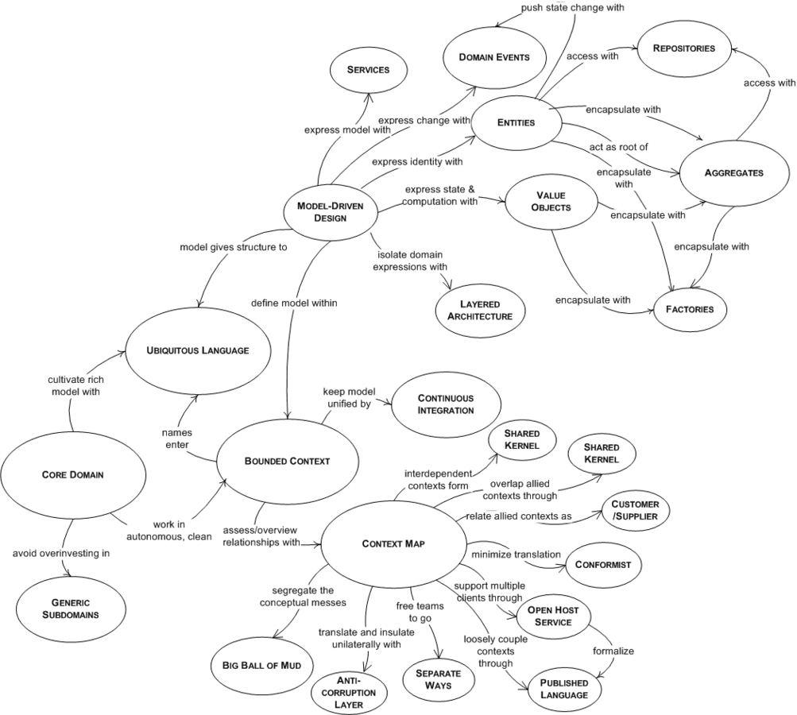
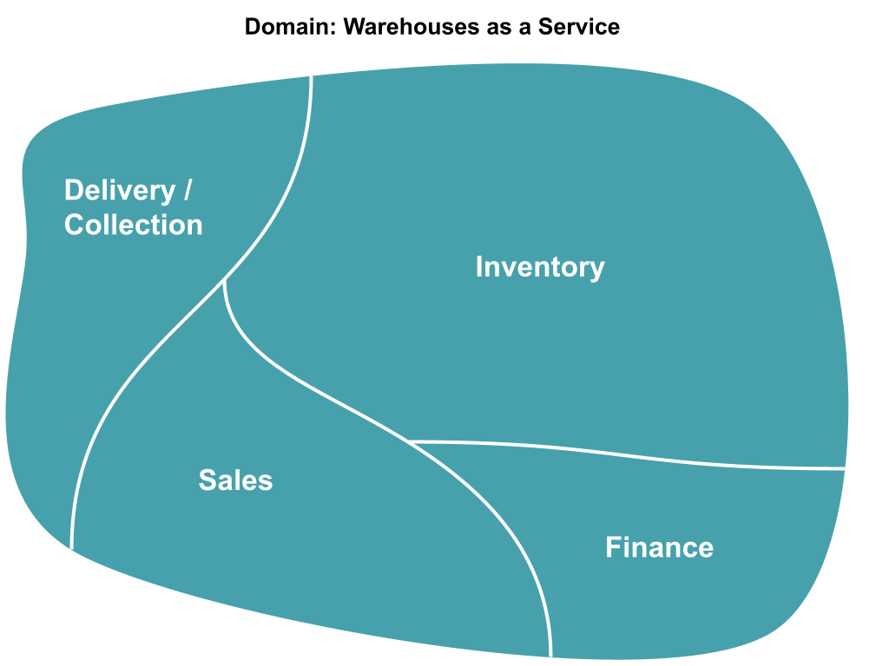
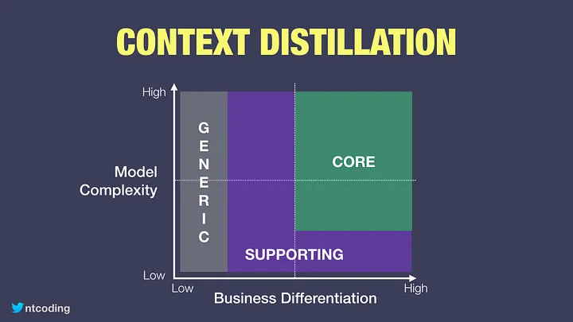
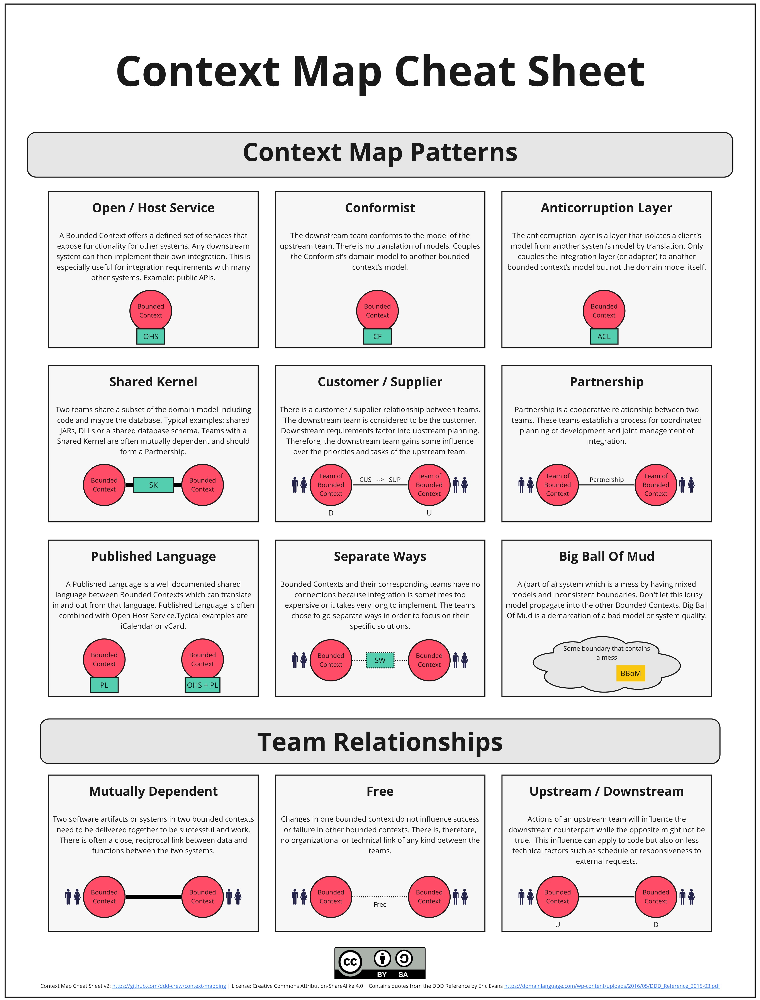
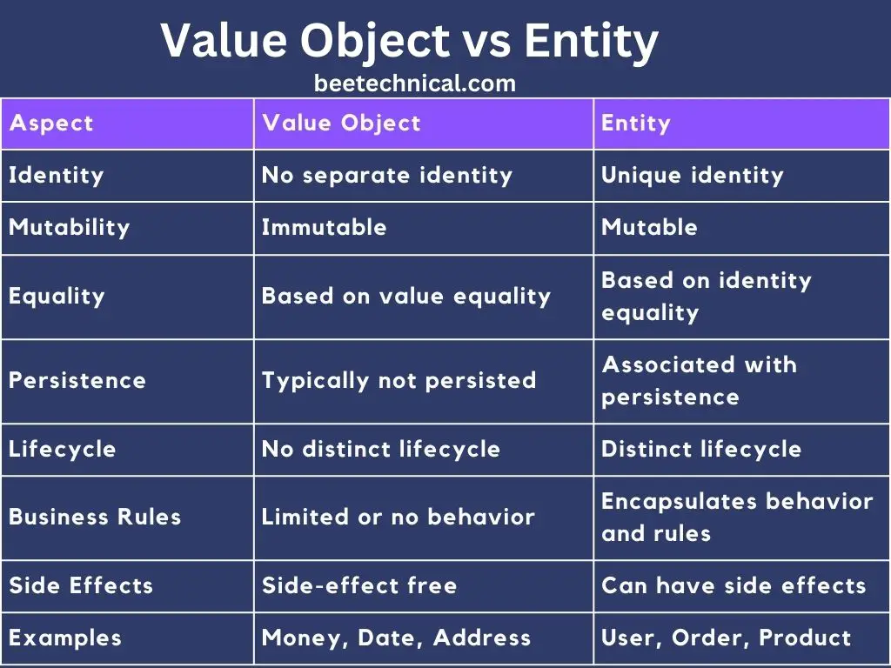

# DDD(Domain Driven Design)
As you might know well, __Microservices__ are being popular approach in recent years.
and it's mostly because it makes our software __scalable and flexible__.
The general idea behind Microservices is every program runs __a small and single task__ and __it must do it really well__ namely in Microservice we divide a huge Software into some small programs.

briefly, __DDD is a way of structuring and modeling our software__. So this means the domain has to be considered DDD(Domain to be more specific) before writing the software. 

### Domain
Domain is a topic that the software tends to work on. So in DDD the engineering team has to meet up with the topic expert(__Domain Expert__) to __share their knowledge__ with engineers.

_explain the treading website at this time._

As you can see DDD has 2 main parts which are __Tactical Design__ and __Strategic Design__.
> Strategic Design contains everything related to the business like treading techniques. 

> Tactical Design contains everything related to the implementing the business.

In essence, Strategic Design is about determining what we need to build. Tactical Design is about how we build it

### Domain Model 
Model is an abstraction of the needed components to handel the domain. And it's mostly made by Domain Experts and Technical Team.

### Ubiquitous language 
It's basically talking in the same language between the Domain Expert and Technical Team. So we need a unified language.

### Prespective
Both Domain Expert and Technical Team should have the same idea about implementation the parts of software.

### Sub Domain
Every subdomain( or a __problem space__ ) is, therefore, a domain, and most domains are a subdomain. The only time I wouldn’t say a domain is also a subdomain is when our model does not contain a higher-level parent domain.  

> Identifying the problem areas in a domain is called __Problem Space Analysis__. This requires close collaboration with __Domain Experts__, the people who know the business best.

Generally speaking there are 3 kinds of subdomains:
 - Core Domain
 - Supporting Domain
 - Generic Domain
 The Core Domain
 
### The Core Domain
The most investment should be put into the subdomains where the business creates a __competitive advantage__, the Core Domains. Without it the business would fail.

A Bounded Context should be created for the Inventory subdomain and the best possible team should be built out to work on this. 

### Supporting subdomain
subdomain, which is less valuable for business than Core domain. Without it business may be can even __survive for some time__. But it still is quite important (supports core domain), it also is specific for the domain and has to be developed. In this case, for some reason, we __can't buy an existing software__ or component to solve the problem.

 ### Generic Subdomain 
 subdomain which is less valuable for business than Core domain. It also is generic enough to allow buying it off the shelf __(unlike supporting domain)__.
 

 ### Bounded Context 
 bounded context defines the clear boundaries within which a particular domain model operates, ensuring that each service only deals with its specific domain. This helps to maintain separation of concerns and enables independent development and

 ### Context Mapping
 ### Why use Context Mapping?
A context map, as the name already suggests, helps you define the relationships between the different contexts of your application __in a mostly visual way.__

### What is Context Mapping?
Context mapping is a tool that allows developers and domain experts to __identify the relationship between bounded contexts__ and the relationship between the teams that are responsible for them.

There are different ways of how we can integrate between two or more bounded contexts:
- Partnership
- Shared kernel
- Customer supplier
- Conformist
- Anticorruption Layer
- Open Host Service
- Published Language

### Partnership
It describes more about the relationship between teams as oppose to actual code. This typically happens when 2 teams working on __2 bounded contexts have aligned and dependent set of goals__. (__see Mutually Dependent__)

### Shared Kernel
2 or more bounded contexts can share a common model. In design terms, the Ubiquitous Language of this shared part is common both all relevant teams. __In code terms, you may have a shared library, or a service__. This is generally a small codebase but difficult to maintain as its related bounded contexts develop, as the teams will tend to go on separate ways as their own bounded contexts evolve.

### Customer Supplier
This approach puts 2 bounded contexts into an upstream and downstream, where the upstream is the supplier, and has to __try and meet the expectations of the customer (downstream)__. But the final decision of what the customer gets comes from the supplier. __This typically works in an autonomous environment within the same organization__, or if the customer is the sole client of the supplier.

### Conformist
This relationship describes the relationship of 2 bounded context, __where the upstream has no interest in supporting the downstream for whatever reason.__ Instead, __the downstream must conform to whatever the upstream provides.__ This can happen when integrating a __new feature with a large__, existing solution that is well established; or using a set of APIs, where the downstream is not the sole customer.

### Anticorruption Layer (ACL)
This is another upstream/downstream relationship at a lower level, where the downstream bounded context implements a layer between itself and the upstream. This layer is responsible for translating the objects given by the upstream into its own models. This approach will guarantee the integrity of the downstream bounded context and keeps it completely ignorant of any foreign concepts. This approach is generally useful for integrating new features to some existing legacy software, where you can treat the existing legacy software as __a black box bounded context and create an ACL for the new feature.__

### Open Host Service (OHS) / Published Language (PL)
I will talk about these two approaches together as they both define a __relationship where the upstream provides a set of well documented or readily available information about the integration models.__ This is __built on top of the Conformist__ approach from earlier, where the downstream is a lot more tolerable. The upstream will also need to provide version support. Typically __the upstream bounded context will support multiple clients and have no interest in especially supporting particular one.__ For example, to conform to Amazon APIs, the downstream will have confidence in the integration by understanding the documentation Amazon provides.

## Tactical Design.
So far what we have leaned were all about Strategic Design and now it's time to talk about 
### Entity
Entities represent objects with a distinct identity that runs throughout their entire lifecycle. They are characterized by their __unique identifiers, such as an ID or a combination of attributes that make them distinguishable.__

__An Entity’s equality is based on its identity,__ not its attributes. In other words, two entities with the same attributes __are still considered different if they have different identities.__

### Value Objects
Value Objects, on the other hand, are __objects without distinct identities.__ They are defined solely by their attributes, and their equality is based on the equality of those attributes. Value Objects represent concepts that are __immutable,__ and any change results in a new Value Object instance.

### Invariants
Invariants are generally __business rules/enforcements/requirements__ that you impose to maintain the integrity of an object at any given time.

### Aggregate
Aggregate is a pattern in Domain-Driven Design. A DDD aggregate is a cluster of domain objects __that can be treated as a single unit.__ An example may be an order and its line-items, these will be separate objects, but it's useful to treat the order (together with its line items) as a single aggregate.

## Useful Links
1.[What Are Domain-Driven Design Aggregates?](https://www.jamesmichaelhickey.com/domain-driven-design-aggregates/)

2.[Implementing Aggregate in Farsi](https://virgool.io/@farshid.azizi/implement-aggregate-in-domin-layer-ddd-gmdurq5tjzuj)

3.[DDD in Farsi](http://hadiahmadi.ir/category/%d9%85%d9%82%d8%a7%d9%84%d8%a7%d8%aa-%d8%a2%d9%85%d9%88%d8%b2%d8%b4%db%8c/)

## Resources
1.[What actually is a subdomain in domain-driven design?](https://stackoverflow.com/questions/73077578/what-actually-is-a-subdomain-in-domain-driven-design)

2.[Domain, Subdomain, Bounded Context, Problem/Solution Space in DDD: Clearly Defined](https://medium.com/nick-tune-tech-strategy-blog/domains-subdomain-problem-solution-space-in-ddd-clearly-defined-e0b49c7b586c)

3.[Domain Driven Design in 10 minutes](https://www.thoughtworks.com/en-au/insights/blog/evolutionary-architecture/domain-driven-design-in-10-minutes-part-one)

4.[DDD, identifying the core domain](https://stackoverflow.com/questions/25274226/ddd-identifying-the-core-domain)

5.[Core Domain Patterns](https://medium.com/nick-tune-tech-strategy-blog/core-domain-patterns-941f89446af5)

6.[All  Domain-Driven Design (DDD) How do you apply DDD to different types of domains?](https://www.linkedin.com/advice/0/how-do-you-apply-ddd-different-types-domains#ddd-benefits)

7.[Domain Driven Design | Deep dive into context mapping](https://medium.com/geekculture/domain-driven-design-deep-dive-into-context-mapping-f9cd8acddd7e#:~:text=Context%20mapping%20is%20a%20tool,Shared%20kernel)

8.[Context Mapping](https://github.com/ddd-crew/context-mapping?tab=readme-ov-file)

9.[Context mapping in Domain Driven Design](https://medium.com/ingeniouslysimple/context-mapping-in-domain-driven-design-9063465d2eb8)

10.[Value Object vs Entity in DDD Understand With Examples | 2023](https://beetechnical.com/tech-tutorial/value-object-vs-entity-class/#:~:text=In%20domain%2Ddriven%20design%2C%20a,distinct%20objects%20in%20the%20domain.)

11.[D D D_ Aggregate](https://martinfowler.com/bliki/DDD_Aggregate.html)
